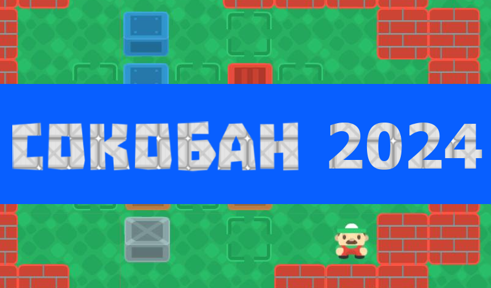

Добро пожаловать в увлекательный мир головоломок с игрой 'Сокобан 2024'!

'Сокобан 2024' - это классическая головоломка, в которой вы играете роль грузчика в складе, сталкивая ящики на определенные места. Ваша задача переместить ящики таким образом, чтобы поместить каждый из них на отмеченное место в ограниченном пространстве.

Сложность игры заключается в том, что ящики нельзя толкать бесконечно, они могут двигаться только вперед и назад, и они не могут пересекаться. Вы должны заранее продумывать каждый ход, чтобы не застрять и не заблокировать себя или ящики.

'Сокобан 2024' предлагает вам увлекательное путешествие через сотни уровней разной сложности, начиная от простых и постепенно переходя к сложным головоломкам. Это отличная игра для тех, кто любит стратегическое мышление и хочет проверить свою логику.

Пеоедвижения по стрелкам на клавиатуре

Welcome to the exciting world of puzzles with the game 'Sokoban 2024'!

'Sokoban 2024' is a classic puzzle game in which you play the role of a loader in a warehouse, pushing boxes into specific locations. Your task is to move the boxes in such a way as to place each of them in the marked place in a limited space.

The difficulty of the game is that the boxes cannot be pushed endlessly, they can only move forward and backward, and they cannot intersect. You must think through each move in advance so as not to get stuck and block yourself or the boxes.

'Sokoban 2024' takes you on an exciting journey through hundreds of levels of varying difficulty, ranging from simple to challenging puzzles. This is a great game for those who love strategic thinking and want to test their logic.

Moving using the arrows on the keyboard.

